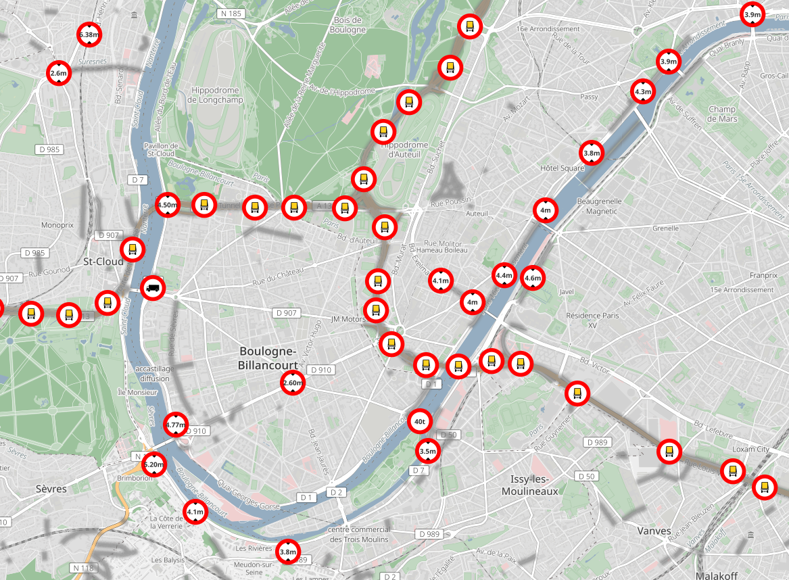

# Max overlay cartocss style

This style provides a raster overlay of max_xxx=* family tags available in OpenStreetMap including:
- max_weight
- max_width
- max_height
- max_length
- max_axleload
- hgv / goods
- hazmat

## data source

A postgresql view (max_view) is used to normalize access to osm2pgsl or imposm schemas.

## Render example

